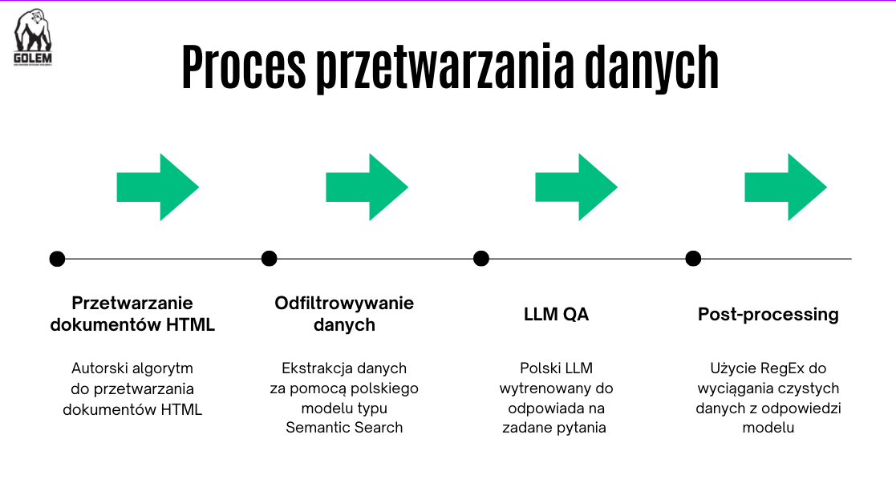

# InterestGuardian

## Overview

The project was created as an approach to the first task, #DEPO_PREDATOR, for the 2023 SuperVision_Hack.

Banks rely heavily on customer deposits to fund their lending activities. However, there's a challenge: deposits are usually short-term, while loans extend over many years. This creates a liquidity gap, where managing the balance becomes crucial. Banks must retain existing funds while attracting new ones from the market. Supervising liquidity risk involves ensuring effective monitoring and crisis management mechanisms. If mishandled, it could lead to a rapid withdrawal of funds triggered by sources like social media, resulting in a 'run on the bank'. In such cases, emergency funding might become necessary. Our tool aims to proactively identify banks facing potential liquidity issues and alert about these risks before they escalate into disasters.
## Table of Contents

- [Installation](#installation)
- [Usage](#usage)
- [Contributing](#contributing)
- [License](#license)

## Installation

Install requirements for the scraping module

`pip install requirements_scraping.txt`

## Usage

Run scraping with 

`python scrape_all_v2.py`

Please note that running this script requires to have at least 4 GB of VRAM and may take up to 15 minutes 

## Deploy

For running our frontend first install streamlit requirements with:

`pip install -r requirements.txt`

and then run:

`streamlit run app.py`

You can also visit our demo website here: https://interestguardian.streamlit.app/

## Content

The most important files are the ones located in scraping module and they are as follows:
1. scraping/html_parser.py - for heavily parsing html documents. It's done so that we can differentiate the subject (e.g. the account type that is described in text segment) as well as to get rid of irrelevant segments.
2. scraping/pdf_handling.py - for downloading and reading text from a pdf file.
3. scraping/text_processing.py - for processing and splitting text into chunks ingestible by DL models.
4. scraping/semantic_search.py - for deciding which chunk is the most important one based on semantic similarity to a query.

One of the most important files are also our executive scripts:
1. scrape_all_v2.py - script that executes the scraping process and glues everything together. It also defines and uses the QA model and some important postprocessing steps.
2. app.y - script that hosts our simple streamlit dashboard

